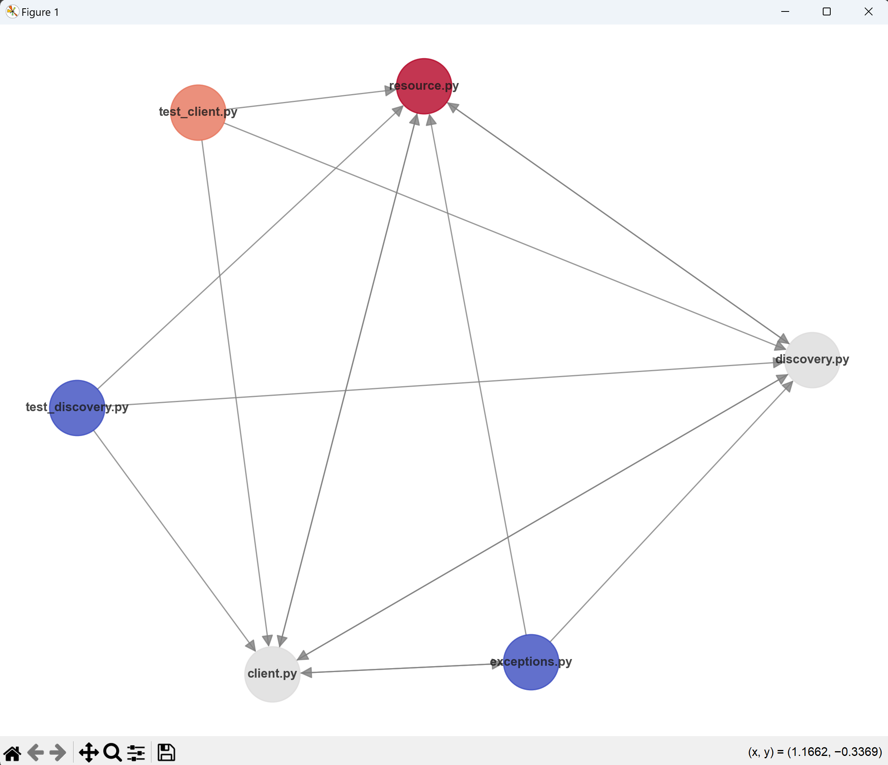

# python-git-history-visualizer

## Overview

The Dependency Visualizer and Git History Analyzer is a Python toolset designed to:

- Extract and visualize function dependencies within Python files.
- Analyze file dependencies across a codebase.
- Integrate with Git to visualize file changes and commit history.

## Features

- **Dependency Extraction:** Automatically parse Python files to determine function calls and their relationships.
- **Graph Visualization:** Visualize function and file dependencies using directed graphs.
- **Git History Analysis:** Integrate with Git to fetch commit details, file changes, and visualize contributions over time.
- **Custom Filtering:** Apply custom filters to dependencies or commit history for tailored analysis.

## Prerequisites

To use the tool, ensure the following:

1. Python 3.8 or newer is installed.
2. Necessary libraries are installed:

- matplotlib
- networkx
- seaborn
- numpy
- tqdm

3. Git is installed and available in your system's PATH for Git-related functionalities.

## Getting Started

### Installation

1. Clone the repository:

```ps
git clone https://github.com/YourideBeurs/python-git-history-visualizer.git
cd python-git-history-visualizer
```

2. Install dependencies:

```ps
pip install -r requirements.txt
```

### Basic Usage

1. Visualize Python Dependencies:

```python
from dependency_visualizer import DependencyVisualizer

visualizer = DependencyVisualizer(folder="/path/to/python/code")
visualizer.parse_python_files()
visualizer.show_file_dependencies(title="Python File Dependency Graph")
visualizer.show_function_dependencies(title="Python Function Dependency Graph")
```

2. Analyze Git History:

```python
from git_visualizer import GitVisualizer

git_visualizer = GitVisualizer(repo_path="/path/to/git/repository")
git_visualizer.parse_commits()
git_visualizer.show_file_changes_scatter()
```

## Example Workflow

### Display file dependencies with git colors

The full example can be found at `examples/display_file_dependencies_with_git_colors.py`

```python
from CodeVisualizer import CodeVisualizer

visualizer = CodeVisualizer('./codebase.db')
visualizer.show_file_dependencies()
```



## Licence

This project is licensed under the MIT License. See the LICENSE file for details.

## Contributions

Contributions are welcome! Feel free to submit issues or pull requests to improve the tool.
